# The operator's manual

For the person sitting in front of a live game, not for the person who wrote
it. It says what every region of the screen shows, what every command does and
what it costs the bot, how to read the numbers without being lied to, and what
to do when the connection goes bad.

Every claim was checked against the running page or the code that draws it.
The pictures are one session of `scripts/manual-shots.js` against
`src/tests/lens-walkthrough-server.ts` (seed 1, three teams, 11 × 11); the text
of every region at the instant of its picture is in
[`design/ux/manual/report.json`](design/ux/manual/report.json), because a
photograph of a readout is not evidence that the readout is right.

Deeper, in that order: [02-IA-AND-CONTROLS](design/ux/02-IA-AND-CONTROLS.md)
(why the screen is laid out this way),
[03-LATENCY](design/ux/03-LATENCY.md) (the wire),
[04-SECONDARY-SCREENS](design/ux/04-SECONDARY-SCREENS.md) (the other screens),
[BOT-BINDING](BOT-BINDING.md) (which bot is playing), and
[10-WALKTHROUGH](design/decision-lens/10-WALKTHROUGH.md) (the surface,
photographed state by state).

---

## 1. Your first five minutes

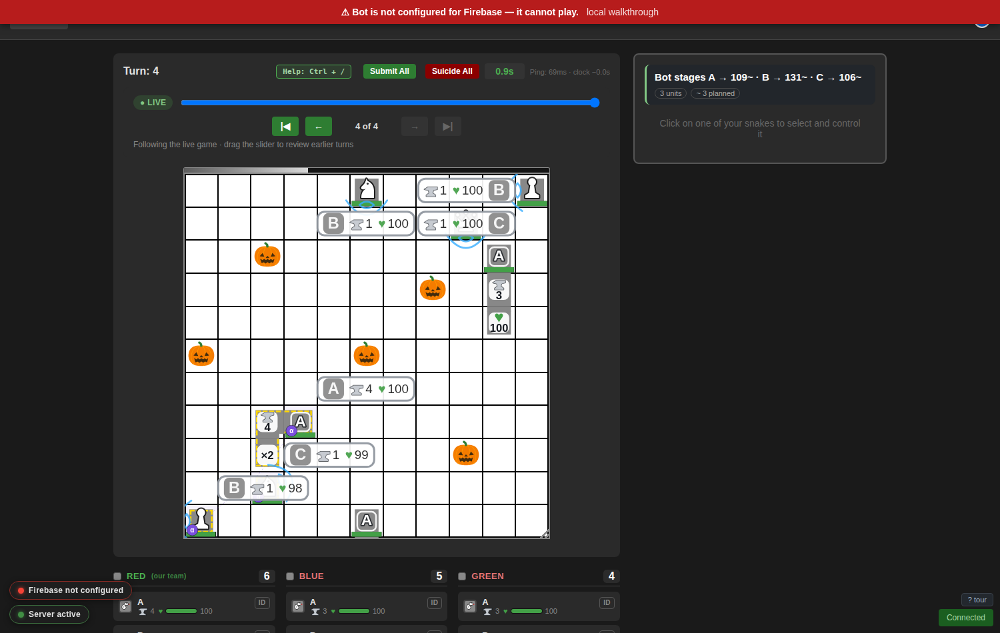

1. **Open the game.** `/play` lists what is running; a row is an ordinary link,
   so `1`…`9` open the first nine, `/` filters, `↑ ↓ Enter` walk them. Each row
   says which bot it is bound to.
2. **Let the tour run.** On your first visit it opens itself: thirteen regions,
   one sentence each, `Enter` to step, `Esc` to leave. It never stops the game.
   Afterwards, `?` then `T`, or the `? tour` link at the bottom right.
3. **Read the top right first.** The **stage line** says what the bot is about
   to do with every unit — `Bot stages A → 109~ · B → 131~ · C → 106~` — and
   the **strip** under it counts what is unfinished: `3 units · ~ 3 planned`.
4. **Watch the bar on the board's top edge.** That is the turn clock: it
   shortens and brightens, and when it is nearly gone so is your turn.
5. **Click one of your units** (or press `Tab`). The rail fills: who it is,
   every legal move, and the ranked list of what the bot would stage.
6. **Disagree with one thing.** Click a candidate cell, read rank 1 and the
   foil beneath it, press `Space`. That is a pin; `U` takes it back.
7. **Do nothing at all.** That is a complete and valid turn — the bot commits
   at the deadline whether or not you touched anything.

## 2. The clock bar


A 10 px bar welded to the board's top edge and resized with it, depleting left
to right, brightening as it goes, turning urgent under **500 ms remaining**.
The digits in the board header (`0.9s`) are the checkable read; the bar is the
one you get without looking away from the board.

**The budget** is `arrival + gameTimeout − 50 ms`, and `gameTimeout` falls back
to **500 ms** when the game server does not say otherwise. The page is never
told it, so it re-learns it each turn as the longest remaining time it has seen.

**The last-safe-press notch.** A press is not free: a lock issued at `T` lands
at `T +` half a round trip `+` the centaur's own work, and the moment after
which a press can no longer land is drawn as a notch — *when something has
measured it*. Nothing on this build sets `window.__lensLastSafePressMs`, so
**the notch on the board's edge is never drawn**; the one on the latency strip's
bar (§3) is, from the same numbers, and it is the one to read.

## 3. The wire, and the ladder

The latency strip reports two things the old interface ran together: how long
you have left (the deadline) and how old what you are reading is (freshness).
Every threshold on it is a **fraction of the turn budget**, not a number of
milliseconds, because a 500 ms turn and a 1,500 ms turn run the same code.

| rung | what it means | drawn |
|---|---|---|
| `DISCONNECTED` | the socket is not open; names the close code | the only red |
| `STALE` | the deadline passed and **nothing has arrived since**, or a frame is older than twice the budget | amber, the fill goes flat |
| `DEGRADED` | the round trip, the game server, an unacknowledged write, a frame a whole budget old, or a turn that never arrived | amber, banner names which |
| `THINKING` | half a budget with no decision frame, still inside the deadline | the dot dims, nothing else |
| `LIVE` | none of the above | **nothing at all** — silence is the signal |

The first rung that matches wins, so what you read is the worst true thing.
Thresholds, with `B` the turn budget (in brackets, at `B` = 500 ms): round trip
warns at `0.1 B` [50 ms] and degrades at `max(150 ms, 0.3 B)` [150 ms]; frame
age is THINKING at `0.5 B` [250 ms], DEGRADED at `1 B` [500 ms] and STALE at
`2 B` [1 s]; game-server lag degrades at `1 B`; an unanswered write degrades at
`max(1200 ms, 3 × RTT)`.

**The four numbers.** `rtt` is your round trip to the centaur; `frame` is how
old the decision you are reading is; `board` how old the board is; `game` how
far behind the *game server* was when the centaur learned of the turn — and it
reads `—`, never `0`, when nobody reported it, because "we do not know" and "no
lag" are different readings.

**Your presses, as chips.** Every command appears as a chip in the frame you
made it in and ages live (`⟳ lock 40ms`), settling to `✓ ack` (it had an answer
of its own), `✓ applied` (weaker: only the next broadcast confirmed it), or
`✗ refused — <reason>`. **A refused chip does not quietly vanish**: it becomes
the refusal and stays nine seconds against an accepted one's two and a half.

### What to do when it says DEGRADED

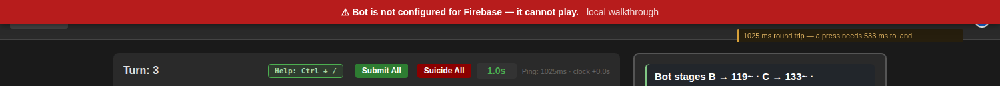

The banner names the cause. Act on the cause, not on the word:

* **`1025 ms round trip — a press needs 533 ms to land`** — the flight is
  eating the turn. Decide *earlier*: press in the first half of the clock, and
  prefer one lock to three pins. Pressing faster does not help; sooner does.
* **`the game server is N ms behind`** — your own wire is fine and the turn was
  already old on arrival. Nothing at the keyboard improves this, and expect the
  bot's own picture to be behind too.
* **`N writes unacknowledged for M ms`** — a hop that is up, fast and not
  answering. Do not re-press: the chip is still pending and a second press is a
  second determination. Wait for it to settle or refuse.
* **`N board updates never arrived`** — turns are being dropped, so the
  countdown may be counting a dead clock. Trust `board +Nms` over it.

### What to do when it says STALE

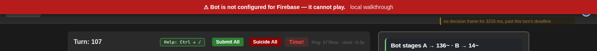

`no decision frame for 3216 ms, past this turn's deadline`. The clock ran out
and nothing has landed since. Determinations are still *offered*, and labelled.
Do not spend one: the picture you would press against is of a turn that is
over. Wait for the next `board-update`; if the strip also says the socket
closed, the page reconnects on its own and says so. A dropped frame and a frame
that was never sent look identical from here, which is why the ladder is built
on **age** rather than on whether the socket is up.

> **A rough edge, on this build.** `play-game.html` carries **two** elements
> with `id="latency-mount"` — a stale one in the page header and the full-width
> strip under the board header — and the browser takes the first, so the strip
> is drawn into a zero-width box. The banner escapes and is readable (both
> pictures above are real); the bar, the notch and the four numbers are clipped
> out of sight. The readings are correct regardless: print them with
> `LatencyView.read()` in the console. The file belongs to another owner this
> cycle; filed, not fixed here.

## 4. The glance layer: what the bot is about to do

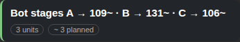

**The stage line** is one sentence, in the largest type in the rail, in a box
that never moves, and it is there whether or not a unit is focused:
`Bot stages A → 109~ · B → 131~ · C → 106~`. It covers every unit this decision
is about — every member of every cluster, plus the constants it is conditioning
on. Four marks, no colour:

*nothing* is a confirmed staged move (the common case, and therefore the quiet
one), `⋯` is requested and not yet confirmed by the game server, `»` is
committed and frozen for this turn, `~` is not a written move at all but the
bot's current *plan* (rank 1), and `◦ no plan` is a unit with neither.

A pinned unit says so — `A → 108 pinned` — and the cell named is the bound, not
the plan: a pinned unit's cell is what the rest of the cluster is solved
against.

**The unfinished-business strip** underneath counts only what the page can know:
`3 units · ● 1 staged · ~ 2 planned · ◦ 1 no plan · 🔒 1 fixed`. A segment that
would read zero is **absent** rather than printed, and there is no `fatal`
segment at all: fatality is knowable only for a move the server has been asked
to stage, so `0 fatal` would be a count nobody took.

## 5. The decision

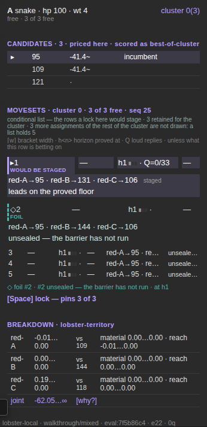

### The focus line

`A snake · hp 100 · wt 4 · cluster 0(3)` and, under it, `free · 3 of 3 free`.
The cluster is the set of units the bot solves *together*; `3 of 3 free` says
how many are still variables rather than constants. If the line says anything
but `free` — `pinned`, `held`, `committed` — the bot is not choosing that
unit's move at all.

### The candidates

Every legal move for the unit, with a **grade and never a bare number**:
`-41.4~` is an estimate, a bare `·` is a price nobody took. Pricing every
candidate costs several times a whole decision, so the rail grades rather than
guesses. `▸` is the cursor, `incumbent` is what the bot has settled on so far.
Clicking a candidate cell asks the bot *what would a lock here stage?* — out of
a small reserve, and **the reserve answers one conditional per decision**, so
exactly one candidate of one unit has a truly ranked list behind it. The rest
say so in the list's own head.

### The two cards

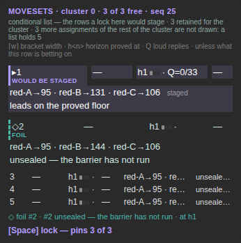

Rank 1 (`▸1 WOULD BE STAGED`, solid rule) and the runner-up (`◇2 FOIL`, dashed
rule) are drawn **full size**, with their bands, assignments and what each is
betting on; ranks 3 and below are one line each. The pair "what will happen"
and "what it nearly was" is the comparison that changes a human's mind, and
drawing rank 1 exactly like rank 5 spends your half-second saying the two
matter equally.

The head says which list you are reading. **`conditional list — the rows a lock
here would stage`**: every row *is* a determination you could issue, with the
locked unit held at your candidate in all of them, and where the list stops it
says which stop — a row cap is a full list, a spent reserve is a refusal and is
drawn as one (`⚠`). **`no conditional was answered — N of M retained rows play
this candidate`**: the fallback, the reservoir narrowed to rows that happen to
play your candidate; if it adds `so [ and ] have nowhere to go`, that is why
the walk keys do nothing.

`[` and `]` walk the list; clicking a row does the same. **Hover never moves
the cursor** — the board and the rail are places to look until something is
pressed.

### The `unless` cell — the threat map

One clause per row, saying what that row is betting on, drawn on the leader too
so that a blank cell and a leading row are different states.
`leads on the proved floor` means the row wins on what has actually been
proved; `unsealed — the barrier has not run` means it was conformed and never
put through the comparison, so nothing is proved about it either way. A clause
that names a threat is a row that stops leading if that threat materialises —
this is the cell to read when you want to know *why* rank 1 might be wrong.

### The breakdown

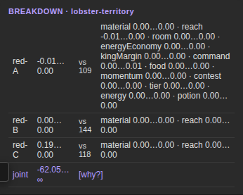

`B` prices the row under the cursor and draws, per member: its contribution,
the reference action it was priced **against** (`vs 109`), and its top terms.
The last row is the **joint residual** (`joint -62.05…∞ [why?]`), mandatory and
drawn even at zero — a cluster exists because of cross terms, so members' deltas
that do not add up are a lie unless the residual is there. `B` on an unpriced
row reads `[B] to price this row`; `Shift+B` expands every member.

## 6. The timeline lane

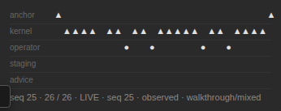

Everything that happened inside this turn, at its own place in it, on five
lanes: `anchor` (a tick at each end), `kernel` (the bot's own emissions, seven
to ten a turn), `operator` (yours and your peers', in the operator's colour —
`pin(red-A) · seq 9 · +149.57ms`), `staging` and `advice`.

Ticks are clickable and the playhead **snaps to events**, never to pixels.
`,` `.` step one event; `Shift+,` `Shift+.` jump emission to emission; `Home`
is the board's arrival, `End` the head, `N` returns to now. Clicking the lane's
footer expands it and reveals hollow `○` attention ticks — a look the search
may speculate on, never a determination anyone made.

Off the head the board's ink desaturates, the badge reads
`⏸ SCRUBBED · seq n · read-only`, and determinations re-label to `[N] return to
now and lock`: **you cannot spend authority against a frame that has been
superseded**, and the surface says so rather than refusing silently.

## 7. The commands, and what each costs the bot

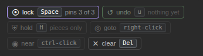

One row of chips, one grammar — **glyph · verb · key · state** — for every
control the focused unit has. They are clickable, so none of this needs the
keyboard: every command below can be reached with unmodified left clicks
alone, which is what a touchscreen, a head pointer and a switch have.

| chip | key | what it does | what it costs the bot |
|---|---|---|---|
| `⦿ lock` | `Space` | stages the candidate under the cursor for the focused unit | that unit stops being a variable: it becomes a **constant** the rest of its cluster is solved against |
| `⦿ lock` | `Shift+Space` | stages the **whole moveset** — pins every member the selected row needs | every unit it pins leaves the cluster; the bot no longer chooses for any of them this turn |
| `↺ undo` | `U` | pops the last thing you did and says what it took back | hands the unit back; the bot solves for it again on the next emission |
| `⛨ hold` | `H` | a **standing order** to hold position — pieces only | governs every turn after it, not just this one |
| `⟂ foil` | `F` | puts the runner-up on the board, dashed, only where it differs | nothing — it is a reading |
| `⌕ drill` | `B` | opens the breakdown for a cluster-mate; a **long-press** on a moveset row does the same | one inspection out of the turn's reserve |
| `◎ goto` | right-click | a destination reward on a cell — drawn as a **cross** | biases the search toward that cell; it is not a command to move there |
| `◉ near` | ctrl-click | a proximity reward — drawn as a **ring** | biases the search toward staying within a radius |
| `✕ clear` | `Del` | clears your manual input for the unit | removes the override; queue and target go with it |

**Two ways to reach `goto` and `near`.** The right-click and the ctrl-click are
the fast path and are unchanged. But there is no right button on a tablet and
none on a switch, so both chips also **arm**: press the chip and it re-reads
`goto — press a cell`, the board takes a dashed ring, and the next ordinary
left press sets the target. `Esc` cancels and the arm expires on its own after
eight seconds. On a touchscreen a **held press** on a cell sets the goto target
too, which is where every platform puts its secondary click.

**Two ways to pick a move.** Click the candidate cell, or **drag from the
unit's head to it** — both reach exactly the same selection, and `Space` stages
whichever you used. A drag that does not start on the unit does nothing. If you
would rather the board ignored drags entirely, `move: click` in the rail turns
them off; click-click always works whatever that is set to.

Also: `Tab` cycles your units, `Esc` deselects (and cancels an armed lock), and
`Ctrl+Enter` is **Submit All**, which is binding and keeps its dialog.

### The one confirmation, and why there is only one

**Undo for everything reversible; a dialog only for what cannot be taken back.**
A confirmation on a reversible action is a wasted interaction, and on a
half-second clock it is a lost turn.

* A **pin** — `Space` on your own unit — fires on the first press and pushes an
  entry onto the undo stack, and the undo chip beside the lock chip names what
  it would take back: `↺ U undoes: lock — 3 pins (red-A, red-B, red-C)`. The
  stack holds eight and is **cleared at the turn boundary**: every entry names
  a command for a board that has since resolved.
* A **lock that pins more than the focused unit** changes what the bot stages
  for units you never looked at, so it **arms** instead of firing:

  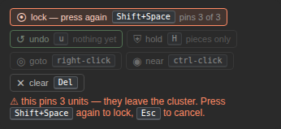

  The chip re-reads `lock — press again`, the count (`pins 3 of 3`) was on
  screen before either press, `Esc` cancels, and the arm **expires on its own
  after four seconds** — an armed gesture that waits forever is a trap you walk
  into on your next press. No modal, no new region, one extra keystroke, and
  the undo is still there afterwards.
* **Dialogs are kept for the irreversible**: Submit All, certain-death consent,
  and taking a unit over from another operator.

`[Space] lock — pins N of M` above the bar is the exact minimum-pin set: at
`pins 1 of 3`, two members already agree with what is staged and only yours
needs writing. If a lock would cross **another operator's** unit it is
refused by name — take the unit over first, or lock rank 1.

## 8. Reading confidence, and reading lookahead

**Confidence is a band, not a number.** Each row's bracket is drawn on one scale
shared by the whole table, so "wider" and "further right" mean the same thing on
every row: the **span** is the proved floor to the ceiling, the **tick** in it
is the estimate (a mark and not a third number, because it never adjudicates),
and an **arrowhead** instead of a right-hand bar means *nothing is proved above
this* — open, not big. The numbers stay beside the band: the band is the fast
read, the text the checkable one, and `⌈w⌉` is the width, where narrow is
confident.

**When a number is missing.** `—` means it is genuinely not there; `∞` and
`−∞` are ordinary readings (`∞` is *nothing is proved above*, not a large
number); `~` is an estimate and `·` is unpriced. A conditional row's numeric
columns read `—` because such a row is an *assignment* and not a price —
`0.0 ⌈0.0⌉` there would be a reading nobody took.

**Lookahead is `h<n>` plus a gauge.** `h1`, one of three segments lit, means
proved at horizon 1 — one ply. Where nothing deepens every row reads `h1`, and
that flatness is *drawn* rather than omitted. `Q` beside it counts loud replies
on the leader's own plan (`Q=0/33` — thirty-three replies, none loud).

**The foil is the cheapest signal on the screen.** One line under the table,
always: the runner-up's rank, why it lost, and the horizon it lost at; where
there is no rank 2 it says so and says why. It carries a margin only when both
rows have prices — a margin between two unpriced rows is the difference of two
numbers that do not exist. `F` puts the foil on the **board**, dashed, only
where it differs.

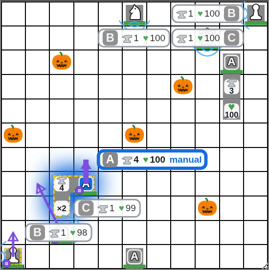

**On the board, only disagreement draws.** A filled arrow is the hypothesis
under your cursor, a hollow one a cluster-mate that would move differently, a
dashed one the foil, and a **ring** a member that already agrees (it gets no
second arrow). Nothing there is carried by colour alone.

## 9. Keys

Three schemes over one action set. Which you want is a hand posture, not an
opinion: `bracket` is the shipped schema unchanged, `vim` for hands that
already do `j`/`k`/`g`/`G`/`u`, `left hand` for keeping the right hand on the
mouse. Pick one in the rail or in `Ctrl+/`; it is remembered per browser. No
chord is in the hot path, and no scheme touches `Tab`, `Esc`, the arrow pad,
`WASD`, `1`–`9`, `Space`, `H`, `Del`, `Enter`, `Ctrl+Enter`, `Ctrl+/` or
`Alt`.

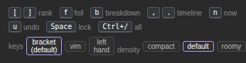

### The hand you use

Three more preferences sit beside the key scheme and the density, in the same
row, and they are the same kind of thing — a hand posture, not an opinion about
the product. They are remembered per browser.

* **`move`** — `click`, `both` (the default), or `drag`. What gesture picks a
  candidate on the board. Click-click works under all three.
* **`hand`** — `R` (the default) or `L`. Which side of the board the control
  column sits on. A left-handed operator's mouse hand should not have to cross
  the board it is reading; nothing else about the layout mirrors.
* **`targets`** — `auto` or `large`. `auto` gives every control the 24 px
  minimum and, on a touchscreen, 44 px. `large` asks for the 44 px figure on a
  mouse too — worth having with a trackball, a head pointer, or a tremor.

**On a tablet or a phone** the interface rearranges itself: the board is clamped
to the screen, the header wraps, and the **command bar sits fixed at the bottom
of the screen** so the lock and the undo are under your thumb while the board is
still in front of you. Everything you press is at least 44 px. See
`docs/design/ux/12-INPUT-MODALITIES.md` for why each of those is where it is.

### Printable cheat sheet

```
                        bracket      vim        left hand
  previous / next rank    [  ]       k  j         q  e
  foil                     F          x            r
  breakdown drill          B          i            t
  drill every member    Shift+B    Shift+I      Shift+T
  timeline step            ,  .      ,  .         z  c
  emission jump         Shift+,  Shift+.       Shift+Z Shift+C
  turn start / head     Home End     g  G         g  v
  back to now              N          n            f
  undo / release           U          u            x

  in every scheme
  ------------------------------------------------------
  Space          stage the candidate under the cursor (a pin)
  Shift+Space    lock the whole moveset — arms if it pins > 1
  Home / End     the two ends of this turn's timeline
  Tab            cycle your units          Esc     deselect / cancel an arm
  H              hold (pieces only)        Del     clear your input
  Ctrl+Enter     Submit All (binding)      Ctrl+/  the full reference
  ? then T       the guided tour
```

The strip in the rail and the `Ctrl+/` modal render from **one table**, so they
cannot disagree and switching scheme rewrites both. Density (compact / default
/ roomy) sits beside it, also remembered per browser: a scale, not a second
design.

## 10. Binding a bot to a game

Two identities are stamped on every decision: `botId`
(`lobster:lobster-territory@6d2c0e5b9a41` — the configuration, hashed, so any
knob change changes it) and `behaviourId` (`git:<sha12>` where the build
published its commit, `pkg:<version>+dist:<sha12>` otherwise). Renaming a bot
is not a new bot; moving a weight by a tenth is.

**`/config` is where you do this** — identity, the bindable catalog, a readback
for any game id, refusals in full, and a composer. Resolution order at the
decision seam, most specific first: `bot.game.<gameId>` (one game), then
`bot.centaur.<centaurId>` (every game that centaur plays), then `bot.default`
(this deployment), then `CENTAUR_BOT` or the shipped bot (the floor). All four
are keys in the `config_store` table except the last.

**To bind one:** pick the scope and the bot in the composer. It writes the
exact `config_store` key, the exact JSON value, the exact upsert **and the
exact `DELETE` that undoes it**, both copyable, side by side; run the upsert
against the database. There is no write endpoint on purpose — a GET that could
re-bind a live game's objective function is not something this server should
own. **Then press `Did it take?`**: it re-reads
`GET /api/play/game/:id/bot` and answers against what you staged, five ways:

* *It took: this game has decided turns with X, from `bot.game.…`* —
  `observed` is true, so this is what actually decided.
* *It took: … resolves to X. No turn has used it yet* — `observed` is false, so
  this is what the *next* decision would resolve to.
* *That bot is in effect, but from `bot.centaur.…`* — a more specific binding
  is winning.
* *Not yet: still resolving Y* — the registry reloads on a **60 s TTL**; ask
  again in a minute. No redeploy is needed.
* *REFUSED, so it is not in effect: `<reason>`* — the binding failed its weight
  check and was **refused whole**, never partially applied, and the lookup fell
  through to the next level. Refusals are drawn at the top of the panel,
  because a game quietly playing the default with no reason anywhere is the one
  failure that must not be silent.

The value may be a bare bot name (`"material-only"`), a named bot plus a dial
excursion (`{"bot":"lobster-territory","candidates":{"gainOrdering":false}}`),
or a profile in full — stored as a JSON string, which is why the bare name is
quoted.

## 11. Opening a replay at a turn

`/history` lists finished games with the **outcome** as the headline (`▲ WON`,
`▼ LOST TO …`, `= DRAW`, `· UNFINISHED`), then the turn count, then how long
ago; `/` filters, `↑ ↓ Enter` walk, `1`…`9` open the first nine. Each row
carries three ways into the lens: the **outcome link** (opens at the turn you
last looked at), **`open at turn [___] Go`** (type a turn and land on it), and
**`↩ resume at K`** (the turn you were last on, remembered per game in this
browser). All three are the same URL: `/game/<id>#turn=<n>`. The viewer honours
the fragment on arrival — it waits for the game's own turn domain, then commits
**one** scrub — and thereafter keeps `#turn=` in step with the playhead, so the
address bar always names the turn on screen and is always pasteable.

A replayed turn draws from the log through the same fold and the same renderer
as a live one: the same candidates, ranked rows, `unless` clauses, breakdown
and joint residual. What differs is the badge (`REPLAY · seq n · read-only`)
and that a replay is offered no "now" to return to — a closed turn does not
have one. It says instead who locked what and when:
`locked by Ada at +149.56ms → [jump]`. A replayed game holds no socket, so it
has no latency strip at all; that is correct, not a fault.

## 12. The tour

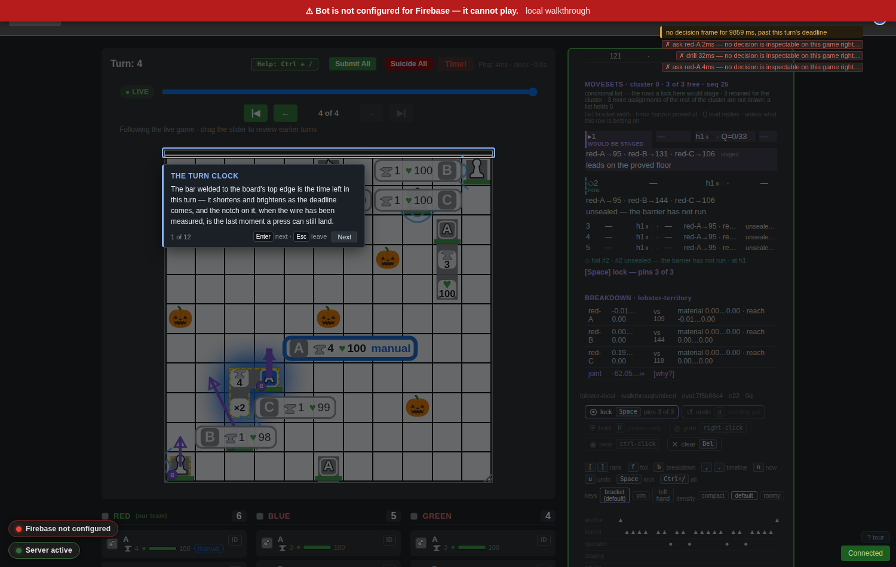

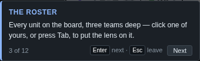

The same thirteen regions, in the same order as this manual, one sentence each,
on your own screen.

* **It opens** on your first visit, on `?` then `T`, or on the `? tour` link.
  **`Enter`** steps, **`←` `→`** step both ways, **`Esc`** leaves — and leaving
  counts as done, so it will not open itself again.
* **It never blocks the game.** It opens no socket, sends no message and writes
  into nothing but its own mount, so no frame and no decision can differ for
  its being open; it claims only `Enter`, `Esc` and the arrow pad, so `Space`
  still stages, `U` still undoes and `[`/`]` still walk the list; and every
  layer of it lets the pointer through to the board. The bot keeps deciding
  underneath it, the clock keeps depleting, and anything you have pinned stays
  pinned and stays live — the spotlight is a hole in a dim layer, not a lid.
* **A region that is not on screen is skipped**, not waited for: with no unit
  focused you get the clock, the board, the roster and the stage line; focus
  one first and you get all thirteen. `prefers-reduced-motion` turns off every
  transition it has.

## 13. Known rough edges

Read these before filing a bug against something already known.

1. **The latency strip is drawn into a zero-width box in the header**, because
   `play-game.html` carries two `id="latency-mount"` elements (§3): the banner
   is readable, the bar and numbers are not.
2. **The board-edge clock's notch is never drawn** — nothing sets
   `window.__lensLastSafePressMs` (§2). The strip's own notch is correct.
3. **`✗ ask <unit> — no decision is inspectable on this game right now`**
   appears without your having asked: the page fires a conditional on every
   unit focus and the server refuses it between turns. Noisy, harmless.
4. **One operator name per game** — re-entering under a different name puts a
   takeover dialog between you and your own units.
5. **`Ctrl+/` covers the board.** On a short clock read the rail's strip.

## 14. Where the evidence is

Every region and its text: `design/ux/manual/report.json`, from the session
these pictures are (`scripts/manual-shots.js`, two servers, one free wire and
one at 500 ms). The tour changing no frame and no decision: the tour drill in
`scripts/lens-walkthrough.js`. The ladder: `src/web/latency.js` and
`design/ux/03-LATENCY.md` §3.2. The commands and the arm:
`play-game.html::lensLock` / `::stageSelectedMove`. The schemes:
`lens-panel.js::SCHEME_KEYS` and the walkthrough's scheme drill. Binding and
its refusals: `BOT-BINDING.md`, `src/web/config.html`. Replay being the same
fold as live: `design/decision-lens/10-WALKTHROUGH.md` §2.
