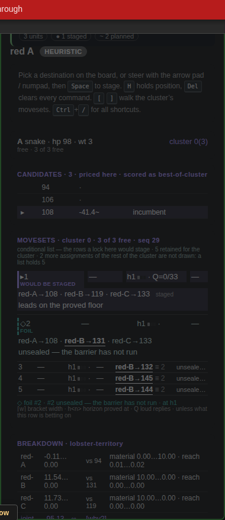
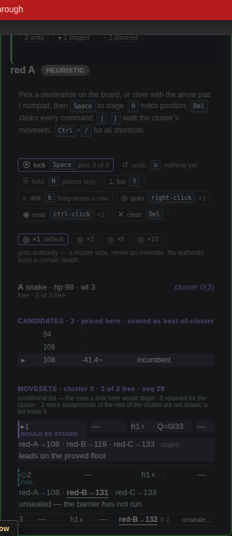
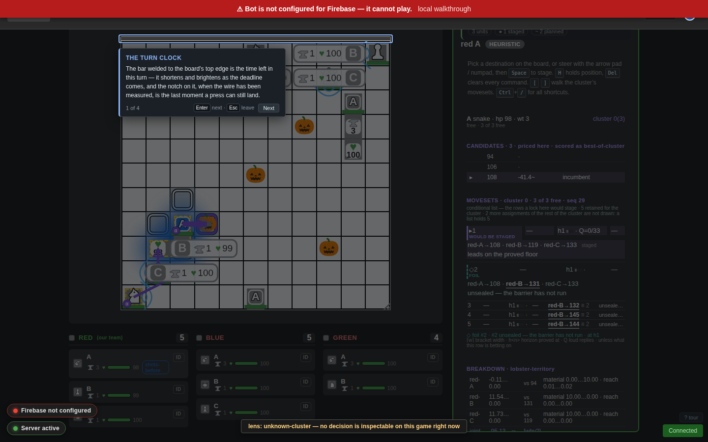
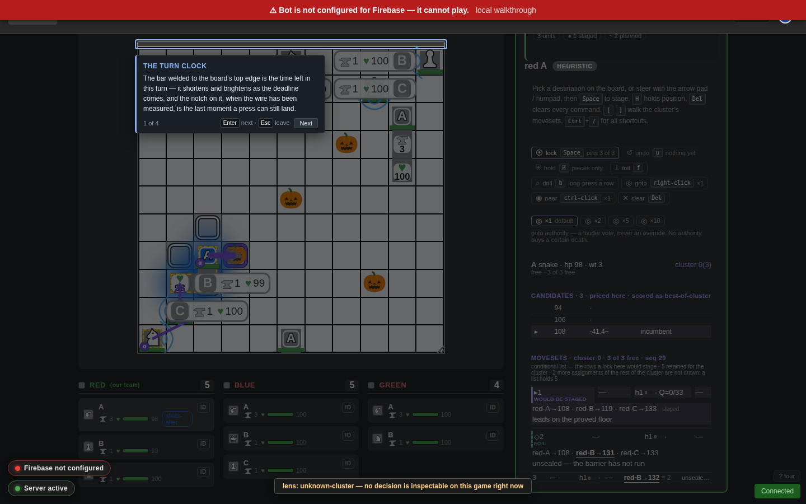

# 16 — COMMANDS: the operator's own column, and how loud an order is

UX lens, document 16. The owner's report, verbatim in its intent:

> Human commands like `goto` (which is the main one in our players' learned
> repertoire right now) are consistently overruled by the bot. Please make
> commands a separate section in the top right corner (with readonly bot
> information in the bottom right corner panel) and make them stable in x,y
> position on the page and add the capacity to control the weight of the
> `goto` command so that it can be configured to overrule the bot by raising
> its loudness / authority.

Three things, and they are one thing: **the operator's half of the interface
has neither a stable place nor a stable voice.** §1 measures the voice, §2
gives it a dial, §3 gives it a place.

Answerable to `02-IA-AND-CONTROLS.md` (the L0–L3 layers and the one chip
grammar), `12-INPUT-MODALITIES.md` (`lensRunAction`: a chip and a key are one
call), `12-PREFERENCES.md` (every preference goes through `window.Prefs`),
`11-MOTION-AND-MARKS.md` (what the board is allowed to draw) and
`09-DESIGN-TOKENS.md` (no new colours).

---

## 1. The diagnosis — why `goto` is overruled, with numbers

### 1.1 What a `goto` actually is

`goto` is not a path override and was never meant to be. The staged move for a
commanded snake is the fold's own per-candidate score with a bounded progress
bonus added, then a certain-death veto
(`ActiveGameManager.getWaypointBiasedMove`):

```
adjusted(candidate) = foldScore(candidate) + weight × progressStat(candidate)
staged              = argmax over candidates that are not certain-fatal
```

with

* `weight = LOBSTER_WEIGHTS.food = 4` for `goto`, `LOBSTER_WEIGHTS.contest = 3`
  for `near` — on the lobster fold's own scale
  (`src/lobster/evaluate/calibration.ts`);
* `progressStat ∈ [0, 1]`, a linear ramp that is `1` for the optimal next step
  along a shortest path and `0` at twice that path
  (`gotoProgressStat`, `src/logic/waypoint-pathing.ts`);
* the veto reading the fold's own worst-case verdict, `bounds.lo === -Infinity`
  (`isCertainFatal`).

### 1.2 The measurement

`src/tests/goto-authority-probe.ts` runs the shipped decision path
(`decideTeam`, the assembly `team-decision-engine.ts` builds) and re-does the
arithmetic above outside the fold, printing per turn per unit: the fold's own
top candidate, the candidate the `goto` favours, the gap between their **fold
scores**, the **stat** of the operator's candidate, the **spread** between that
stat and the fold leader's, the resulting bias, and the authority the order
would need to win.

```
npx ts-node --transpile-only src/tests/goto-authority-probe.ts
npx ts-node --transpile-only src/tests/goto-authority-probe.ts --authority=10
```

**Scene A — a meal one step the other way.** Snake at `5,5`, food at `4,5`,
the operator's `goto` at `9,5`.

| turn | unit | fold top | est | goto pick | est | gap | stat | spread | bias ×1 | followed | needs |
|---|---|---|---|---|---|---|---|---|---|---|---|
| 1 | snake | `4,5` | 31.33 | `6,5` | 21.27 | **10.07** | 1.00 | 1.00 | **4.00** | **no** | ×3 |
| 3 | snake | `4,7` | 36.22 | `5,6` | 36.16 | 0.06 | 1.00 | 0.40 | 1.60 | yes | ×1 |
| 4 | snake | `4,8` | 36.02 | `5,7` | −4.77 | **40.80** | 1.00 | 0.33 | 1.33 | **no** | ×31 |

**Scene B — an open board, target ten steps off** (`9,9`), the same units:

| turn | unit | gap | stat | spread | bias ×1 |
|---|---|---|---|---|---|
| 5 | snake | 0.05 | 1.00 | 0.29 | 1.14 |
| 7 | snake | 0.03 | 1.00 | 0.22 | 0.89 |
| 9 | snake | 0.03 | 1.00 | 0.18 | 0.73 |
| 3 | knight | 10.04 | 1.00 | 0.50 | **150.00** |

### 1.3 The verdict, in the terms the question was asked in

It is **the weight's scale**, compounded by **the stat's effective range** —
not the veto, not a turn-boundary staleness, and not a command that fails to
reach the bias.

1. **The scale.** The bias is capped at `weight × 1 = 4`. The fold's material
   term is `10` per unit weight and the survival cliff lives inside it, so a
   single meal moves the fold by ≈ `10` (measured: 31.33 vs 21.27, a gap of
   **10.07**). Four cannot answer ten. A `goto` therefore loses every position
   in which the bot sees anything worth a unit's weight in the other
   direction — which, in a game about eating and contesting, is most turns
   that matter.
2. **The range, which is worse than the scale suggests.** What orders two
   candidates is not the stat but the DIFFERENCE between their stats, and for a
   target `d` steps away that difference is at most `2/(d−1)`: every candidate
   is nearly as close to a distant target as every other. So the bias that
   actually discriminates is `weight × 2/(d−1)`, which at `d = 10` is **0.73 to
   1.14**, not 4 (Scene B). The nominal weight is already an order of magnitude
   under material; the effective one is two.
3. **The veto is innocent, and is correct.** In Scene A turn 4 the operator's
   candidate is priced at **−4.77** against a leader at 36.02 — a gap of 40.80,
   which is the fold saying the step loses a unit. Nothing here should follow
   that order, and nothing does.
4. **The turn boundary is innocent.** `getWaypointBiasedMove` re-reads the
   CURRENT target against THIS turn's evaluations on every stage
   (`turnData.gameState.turn !== game.boardStateTurn` returns null rather than
   deciding on stale rows), and the route the board draws is rebuilt from the
   staged move. Every row above is a fresh re-scoring.
5. **But there ARE two code paths, on two scales.** A snake is re-biased on the
   fold's scale at `4`; a **piece** is scored in `computePieceCandidates` on the
   legacy heuristic scale at `DEFAULT_CONFIG.gotoProgress = 300`, over a base
   weight of `0` because the bot has no piece evaluator. So a piece's `goto` is
   never overruled at all (`0/12` rows, Scene B) and a snake's is routinely
   overruled. The complaint is **snake-shaped**, and any fix that touched only
   one of the two paths would leave the product with two different meanings for
   one word. §2 therefore multiplies the same factor into both.

---

## 2. Authority — one number, carried with the order

**One parameter: `authority`, a multiplier on the progress WEIGHT (never on the
stat), default `1`, band `×1 … ×10`.** `×1` is the shipped behaviour exactly.

### 2.1 Where it flows

| stage | where | what |
|---|---|---|
| page | `play-game.html` `lensGotoAuthority`, default from `Prefs.get('command.gotoAuthority')` | the dial the operator turns |
| page → wire | `setWaypointForSnake` | rides ON the waypoint: `{type, x, y, authority}` inside the `set-waypoint` message — one attach point, so the right-click, the ctrl-click, the armed chip and the shift+alt append all carry it |
| wire → store | `websocket-server` `case 'set-waypoint'` → `ActiveGameManager.setWaypoint` | passed through unvalidated and normalised at the single boundary that owns every other field (`normalizeAuthority`: absent/NaN → 1, else clamped to `[1, 10]`) |
| store | `SnakeIntent` `{kind:'goto', targets, authority}` / `{kind:'near', target, authority}` | a property of the ORDER, so replacing the intent replaces it, an append re-voices the queue, and a queue that shifts on arrival keeps it |
| store → bias | `ActiveGameManager.waypointWeight(wp) = base × authority` | ONE multiplication, read by `getWaypointBiasedMove` (snakes) and `computePieceCandidates` (pieces). No per-kind rule; no second place the factor is applied |
| store → page | `getWaypointsForGame` → `waypoints[unit].authority` | so the `goto` chip and the board marker can show how loud the standing order is |

### 2.2 What an authority cannot buy

**A certain death.** `argmaxSurvivingMove` filters candidates the fold's own
worst case reads as DEAD *before* any score is compared, so the veto runs on
membership of the pool, not on magnitude: no multiplier reaches it. Scene A
turn 4 needs `×31` and is refused at `×10`; a candidate the fold has proved
fatal is refused at every authority there is. This is said in the UI — under
the dial, in the shortcuts pane, and in the operator manual — because "louder"
invites exactly the wrong belief and the veto is the one fact an operator must
not learn by dying.

Asserted deterministically in `src/tests/wire-command-authority.test.ts`
(round-trip, append re-voicing, clamping, `×1` loses / `×10` wins the same
position, and the veto at `×10`), and on the live surface by the `authority`
drill in `scripts/input-drill.js`.

### 2.3 The surface

* **The dial** is four chips — `×1 ×2 ×5 ×10` — in `#lensAuthority`, directly
  under the control bar in the commands panel. Same `chipHTML` grammar, same
  `data-lens-action` dispatcher, same `role="button"` the panel's own keydown
  handler activates, so pointer and keyboard reach it by the same call
  (12 §3). The active step takes the bar's existing `primary` tone; no new
  colour.
* **Turning the dial is a command.** If the focused unit already has a standing
  order, raising the authority re-issues it at the new loudness in the same
  turn rather than waiting for the next press.
* **The current authority is visible where the order is**: on the `goto` /
  `near` chip (`set ×10`) and on the board marker (`×10`, stroked white,
  bottom-right of the active target cell, drawn only above `×1` so an ordinary
  marker stays quiet).
* **The default is a preference**, `command.gotoAuthority`, in the new
  `Commands` group of the `Prefs` schema — the enum, the default, the labels
  and the validation stated once, there (12 §2.3).

---

## 3. The layout — two boxes, split by authorship

### 3.1 What was wrong

The right column was **one scroll region** holding, in order: the stage line,
the focus/candidates/movesets/breakdown panels, the control bar, the key sheet
and the lane. So the operator's controls sat wherever the bot's panels happened
to end, and the bot's panels change size every turn — a moveset table with
three rows one turn and eleven the next.

Measured, `screens/commands/report-before.json`, `#lensControls` over three
consecutive turns at 1440×900:

```
before:  y = 921, 598, 598      →  stable: false
after:   y = 252, 252, 252      →  stable: true
```

**323 px**, under the operator's hand, inside a 500 ms turn. That is the whole
of the "commands are hard to give" half of the complaint, and no amount of
authority fixes it. After: the commands box is `{x: 937, y: 21, w: 346,
h: 424}` and the bot box `{x: 937, y: 431, w: 346, h: 432}` on **every** turn —
identical rectangles, not merely similar ones.

### 3.2 What it is now

`#selectedSnakePanel` is a two-row CSS grid, sticky at `top: 12px`, and the
split is **by authorship**:

* **TOP RIGHT — `#railCommands`**, a **fixed-height** box (`424px`; `376px`
  compact, `480px` roomy, so density still applies — 12 §2.3) that scrolls
  inside itself if a turn ever overflows it. It holds everything the operator
  WRITES: the stage line and its unfinished-business strip, the unit header and
  status line, `#lensControls` (stage/lock, undo and its note, hold, foil,
  drill, goto, near, clear) and `#lensAuthority`.
  * **The stage line inside it is fixed too** (`88px`, own scroll). Fixing only
    the outer box was not enough: the bot's sentence — `Bot stages A → 109~ ·
    B → 131~ · …` — wraps to a second line as units are added, measured `60px`
    one turn and `82px` the next, and carried every chip under it **21 px** down
    the page. The panel was still; the controls were not. What the operator
    presses is the thing that has to stand still.
* **BOTTOM RIGHT — `#railBot`**, `minmax(0, 1fr)` with `overflow-y: auto`. It
  holds everything the bot SAYS, read-only: `#lensRail`
  (focus/candidates/movesets/breakdown/provenance), `#lensKeys` and
  `#lensLane`.

The panel itself is `overflow: hidden`, which is what makes the first row still:
only the second row scrolls, so nothing the bot renders can push a control.

**Every id is the id it always was.** The markup moved; nothing was renamed and
nothing was rebuilt. `#selectionUI` kept its name and its bot panels and gained
a sibling, `#commandsUI`, shown and hidden on the same rule — so every drill,
every screenshot selector and every `getElementById` on the page still resolves.

Below 1180 px nothing changes: the column is a plain block again, and the
coarse-pointer rule that pins `#lensControls` to the thumb zone (12 §2, I-5) is
untouched.

### 3.3 The pictures

| | |
|---|---|
|  |  |
| the right column before: one scroll region, controls at the bottom of whatever the bot rendered | after: commands top-right at a fixed box, read-only bot information below it in its own scroll box |

| | |
|---|---|
|  |  |

Taken by `node scripts/commands-shots.js --phase=before|after --port=5731`,
which also writes `report-<phase>.json` — the measured DOM rectangle of every
region over three successive turns, and the `controlsYStable` verdict that is
the actual evidence behind the pictures.

---

## 4. Gates

| gate | |
|---|---|
| `npx tsc --noEmit -p .` | clean |
| `npx eslint src/**/*.ts src/web/*.js scripts/*.js` | clean (one pre-existing warning in `src/tests/input-layer.test.ts`) |
| `npm run build:lens` | rebuilt |
| `npx jest "src/tests/lens-" "src/lobster/__tests__/lens-" src/tests/wire src/tests/local-game-determinism.test.ts src/tests/fatal-consent-and-reversal.test.ts` | 28 suites / 465 tests |
| `scripts/lens-walkthrough.js` | 101 checks, 0 failures (its `prefs` group list gained `command`) |
| `scripts/input-drill.js` | 50/50 — pointer / drag / handedness / touch, plus the new `authority` drill |
| `src/tests/wire-command-authority.test.ts` | the authority round-trip and the veto |
